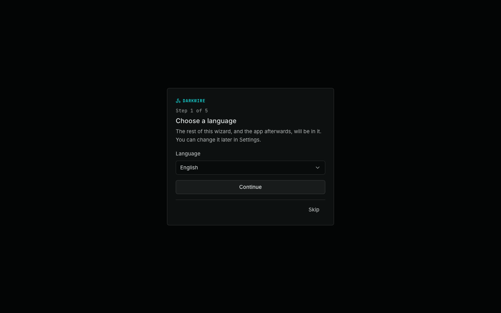
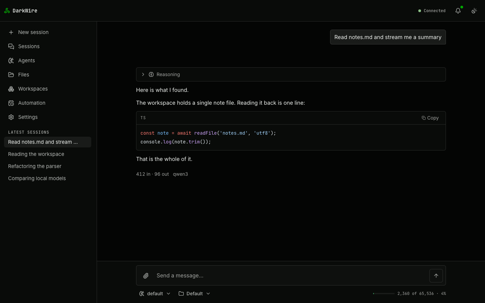
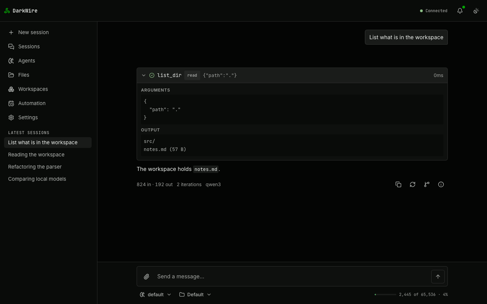
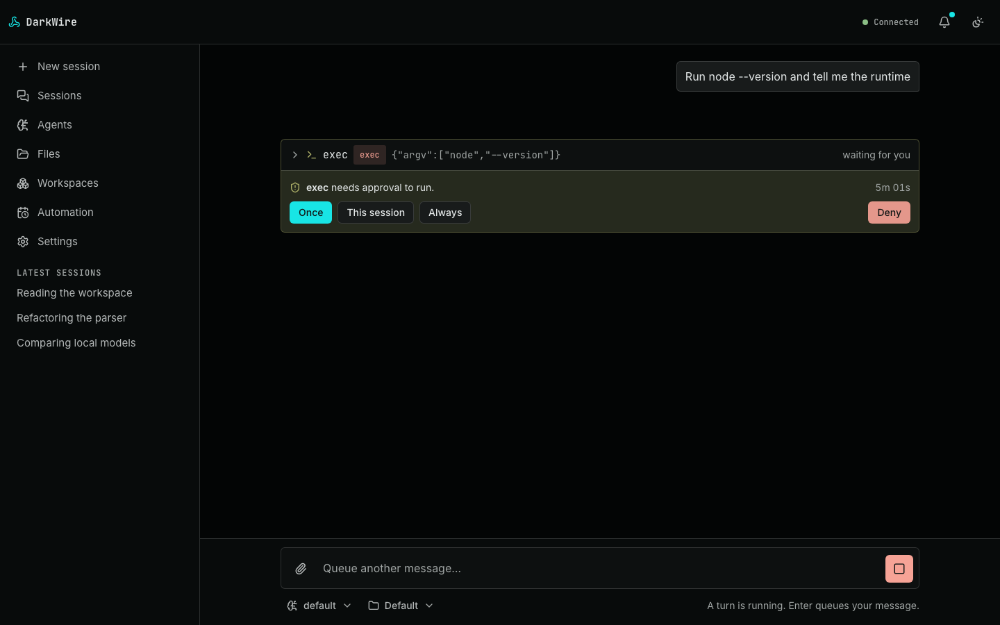

# Getting started

**Who this is for:** anyone who wants a working GhostAI and has not installed it yet. It
runs from nothing to a first answer, then points at the pages that go deeper. Everything
here is a thing to do; the reasoning lives in the pages it links to.

Budget about ten minutes, most of which is a model download.

## 1. What you need

|             | Why                                                                                      |
| ----------- | ---------------------------------------------------------------------------------------- |
| **64-bit**  | macOS or Linux, Intel or ARM. There is a build for each of the four.                     |
| **A model** | Either [Ollama](https://ollama.com) running locally, or an API key for a cloud provider. |
| **Docker**  | Optional. Only for [containers](containers.md).                                          |

That is the whole list. GhostAI is a single binary with the browser UI compiled into
it: no runtime to install, no database, no compiler, no second service.

On Linux the builds are against glibc 2.35, which is Ubuntu 22.04, Debian 12, RHEL 9 and
anything newer, and every one of them is 64-bit: x86_64 or arm64. An older distribution,
or a 32-bit userland, is the case that needs a build from source.

Raspberry Pi earns its own paragraph, because `uname -m` misleads there. The 32-bit
Raspberry Pi OS image boots a 64-bit kernel on any Pi able to run one, so the machine
reports `aarch64` while every library on it is `armhf`. An aarch64 binary installed there
cannot start — the interpreter it names, `/lib/ld-linux-aarch64.so.1`, is not present, and
the kernel's `ENOENT` reaches the shell as `not found` about a file that is plainly there.
`dpkg --print-architecture` is the answer that decides: `arm64` runs the release, `armhf`
needs the 64-bit Raspberry Pi OS image or a build from source. The installer asks it for
you and refuses before it downloads anything.

For the local route, before you start:

```bash
ollama serve          # in its own terminal
ollama pull qwen3     # a few gigabytes; this is the slow part
```

## 2. Install

```bash
curl -fsSL https://raw.githubusercontent.com/therezor/GhostAI/main/install.sh | sh
```

It picks the build for your machine, verifies it against the release's `SHA256SUMS`
before extracting anything, and puts the binary in `/usr/local/bin` — asking for `sudo`
only if that directory is not yours, and saying so first. `--dir ~/.local/bin` puts it
somewhere else, and `--version v1.2.3` installs a particular release rather than the
latest.

<details>
<summary>Or download it yourself</summary>

Every [release](https://github.com/therezor/GhostAI/releases/latest) carries four
tarballs and a `SHA256SUMS` file. Take the one for your machine — `aarch64` or
`x86_64`, `apple-darwin` or `unknown-linux-gnu` — and put the binary on your PATH:

```bash
# Substitute your target for the placeholder; `latest` resolves to the current release.
curl -fsSLO https://github.com/therezor/GhostAI/releases/latest/download/ghostai-<target>.tar.gz
curl -fsSLO https://github.com/therezor/GhostAI/releases/latest/download/SHA256SUMS
shasum -a 256 --ignore-missing -c SHA256SUMS     # sha256sum -c on Linux

tar xzf ghostai-<target>.tar.gz
sudo install ghostai-*/ghostai /usr/local/bin/
```

Do run the checksum line. It is the one step that distinguishes "the release" from
"whatever arrived", and it is the reason the script above exists — there, it is not a
step that can be skipped.

If you downloaded the tarball in a browser rather than with `curl`, macOS attaches a
quarantine flag and Gatekeeper will refuse the binary. `xattr -d com.apple.quarantine
ghostai` removes it.

</details>

The asset names carry no version, so the lines above keep working after the next
release. The directory _inside_ the tarball does carry one, which is what tells you
later which build you extracted.

That is the whole install. The tarball holds one file, the browser UI is compiled into
it, and nothing else is fetched at any point — see [Security](security.md).

**Each binary is built on its own architecture** rather than cross-compiled, because
the credential vault talks to the platform keychain and the container runner signals
process groups. Windows is not built yet; both of those are POSIX here.

<details>
<summary>Running from source instead</summary>

For working on GhostAI, or for running a commit that has not been released. Needs
pnpm 11 (`corepack enable`) and `rustup`.

```bash
git clone https://github.com/therezor/GhostAI.git
cd GhostAI
pnpm install
pnpm build                                  # the web bundle the binary embeds
cargo build --release -p ghostai            # → target/release/ghostai
```

`pnpm build` is not optional even if you only want the API: `rust-embed` compiles
`packages/web/dist` into the binary, so a missing bundle fails the build rather than
producing a server with no UI. See [Development](development.md).

</details>

## 3. First run

```bash
ghostai serve
```

It starts with nothing configured and prints a one-time code:

```
GhostAI is listening.

  URL        http://127.0.0.1:3000
  Auth       enabled
  Agent      not configured — add a provider in the UI, or run `ghostai init`
  Workspace  /Users/you/.ghostai/workspace

First run. Open the URL above and enter this one-time code:

      K7QF-2M9X-BW4T

  It works once, and stops working as soon as you set a password.

Press Ctrl-C to stop.
```

`Agent  not configured` is expected on a first run — the wizard is about to fix it.

Open the URL. The wizard asks for a language, that code, a username and password, then a
provider and a model.

<picture>
  <source media="(prefers-color-scheme: light)" srcset="screenshots/setup.light.png">
  
</picture>

Two things worth knowing here:

- **The provider step lists models from the endpoint itself.** On a machine running
  `ollama serve`, the model question is a list rather than a text box.
- **Everything after the password is skippable.** An install with no model still browses
  files, manages workspaces and settings, and shows notifications — only the composer is
  disabled, and it says so and links to the panel that fixes it.

Prefer the terminal? `ghostai init` asks the same questions with no browser, then
`ghostai chat` talks to it. Both surfaces share one `ghost.db`, so a session you start in
one is the row the other lists.

**Ready-made agents** — a researcher, an analyst for documents and data, a media
specialist for audio and video, a coder, a coordinator that delegates to all of them, and
a no-tools fast lane — live in the separate
[`GhostAI-presets`](https://github.com/therezor/GhostAI-presets) repository, versioned and
updated on their own. One command fetches it and asks which ones you want:

```bash
ghostai preset install
```

Tick the agents you want and it does the rest — including building the container images
the ones you ticked need, which is why picking only `nano` needs no Docker at all. The run
`ghostai container list` then prints what each installed container may do — its limits,
its capabilities, any hardening it switches off — so you can read a definition before an
agent uses it. [Containers](containers.md) explains what each definition decides.

## 4. Your first conversation

The agent can only read and write inside one folder, called the **workspace** — by default
`~/.ghostai/workspace`, which starts empty. Give it something to look at:

```bash
mkdir -p ~/.ghostai/workspace
echo '# Notes

Remember to water the plants.' > ~/.ghostai/workspace/notes.md
```

Then ask, in the composer:

```
Read notes.md and tell me what is in it.
```

<picture>
  <source media="(prefers-color-scheme: light)" srcset="screenshots/chat.light.png">
  
</picture>

The answer streams. If the model reasoned first, that arrives in its own collapsible
block rather than folded into the answer.

**When it uses a tool you get a card**, one per call, with what it ran and what came
back:

<picture>
  <source media="(prefers-color-scheme: light)" srcset="screenshots/chat-tool-call.light.png">
  
</picture>

## 5. Giving it a real project

A single note is not much to work with. Either copy a project into the workspace, or point
GhostAI at one where it already lives:

```bash
ghostai serve --workspace ~/code/my-project
```

Now browse and edit it on the **Files** screen, or just ask the agent to.

**It cannot reach anything outside that folder**, and not as a matter of good behaviour: a
path like `/etc/passwd` addresses `<workspace>/etc/passwd`, and a symlink inside the
workspace pointing outside it is refused. See [Security](security.md#workspace-jail) —
including the one case where that stops being true, which is the next step.

Want more than one project? **Workspaces** — each is a folder with its own sessions,
memory and skills, switched from the sidebar or with `/workspace` in the terminal.

## 6. Letting it run commands

The agent can run shell commands from the start — but not without telling you. `exec`
ships set to **`ask`**, so the first time it wants to run something, the turn stops and
shows you the exact command first.

<picture>
  <source media="(prefers-color-scheme: light)" srcset="screenshots/chat-approval.light.png">
  
</picture>

Answer **Once**, **This session**, **Always**, or **Deny**. "Always" writes the permission
onto the agent, so it is a settings change you made from a prompt rather than a mood.

Those permissions belong to an **agent** — a named set of settings (a model, a prompt, and
a list of which tools it may use) that a conversation runs on. You start with one, called
`default`, and can add more: a "researcher" that may browse but not write, a "builder"
that may run your test suite. Edit them under **Agents**.

Each tool in an agent's list is `allow`, `ask` or `deny` — and a tool that is not in the
list at all is not merely refused, it is never offered to the model in the first place.
See [Tools & permissions](tools.md).

> **Worth reading once before you turn `exec` to `allow`.** The workspace is an
> organisational boundary, not a security boundary, wherever host `exec` is enabled — a
> command it spawns is a normal process on your machine and does not honour the jail.
> [Containers](containers.md) are the answer to that: `exec` inside a digest-pinned
> container with caps dropped and a read-only root.

## 7. Where your things live

Everything is under `~/.ghostai`, or `$GHOSTAI_HOME`:

| Path                         | What                                                                                |
| ---------------------------- | ----------------------------------------------------------------------------------- |
| `config.yaml`                | The settings tree. **Safe to commit** — no credentials are in it.                   |
| `ghost.db`                   | Sessions, messages, turn stats, auth, notifications, approvals.                     |
| `vault.json` + `vault.key`   | The encrypted credential vault. The key moves to the OS keychain when there is one. |
| `workspace/`                 | The only tree the agent's file tools can reach.                                     |
| `containers/`, `extensions/` | Installed manifests — beside the workspace, never inside it.                        |

API keys never go in `config.yaml`. They go to the vault, keyed by provider instance, so
you can commit your settings and share them.

## 8. Adding a second model

`providers` is keyed by an **instance id you choose**, with `type` naming a registry
entry — which is how two Ollama boxes become two entries with different addresses:

```json
{
  "providers": {
    "ollama": { "type": "ollama" },
    "gpu-box": {
      "type": "ollama",
      "label": "GPU box",
      "apiBase": "http://gpu.lan:11434/v1"
    }
  }
}
```

Add one in **Settings → Providers**, which tests the connection as you type, or switch
per session with `/model` in the terminal. Ollama, LM Studio, llama.cpp and vLLM need no
key at all. See [Providers](providers.md).

## What next

| Page                                      | What it covers                                       |
| ----------------------------------------- | ---------------------------------------------------- |
| [CLI](cli.md)                             | Every command, flag and slash command                |
| [Configuration](configuration.md)         | Every key in `config.yaml`, its type and its default |
| [Tools & permissions](tools.md)           | The eight built-ins and who may call them            |
| [Web UI](web-ui.md)                       | Every screen, and what it does                       |
| [Security](security.md)                   | Each guard, the attack it closes, and its limits     |
| [Prompts](prompts.md)                     | The eight templates you own, and the caching split   |
| [Memory](memory.md) · [Skills](skills.md) | What it remembers, and the sheets it can read        |

Not working? Two things account for most of it:

- **The composer says no model is configured.** The provider saved but the model did not,
  or the endpoint is unreachable. Settings → Providers tests the connection.
- **The browser gets a JSON 404 rather than the app.** That is a binary built without
  the web bundle — `GHOSTAI_HEADLESS_BUILD=1`, or a source build where `pnpm build`
  did not run. A release tarball always has it.
