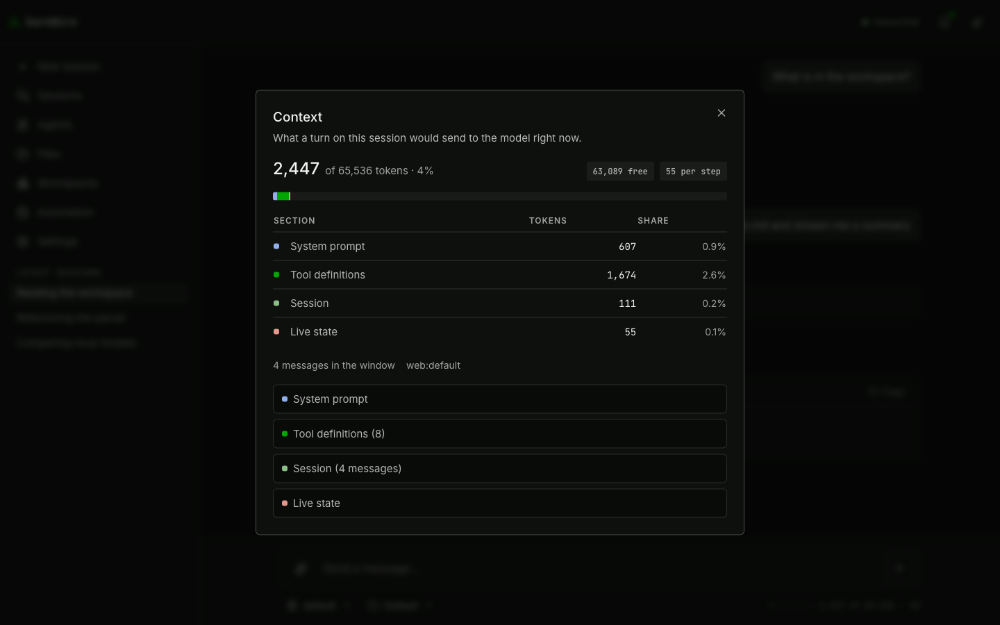
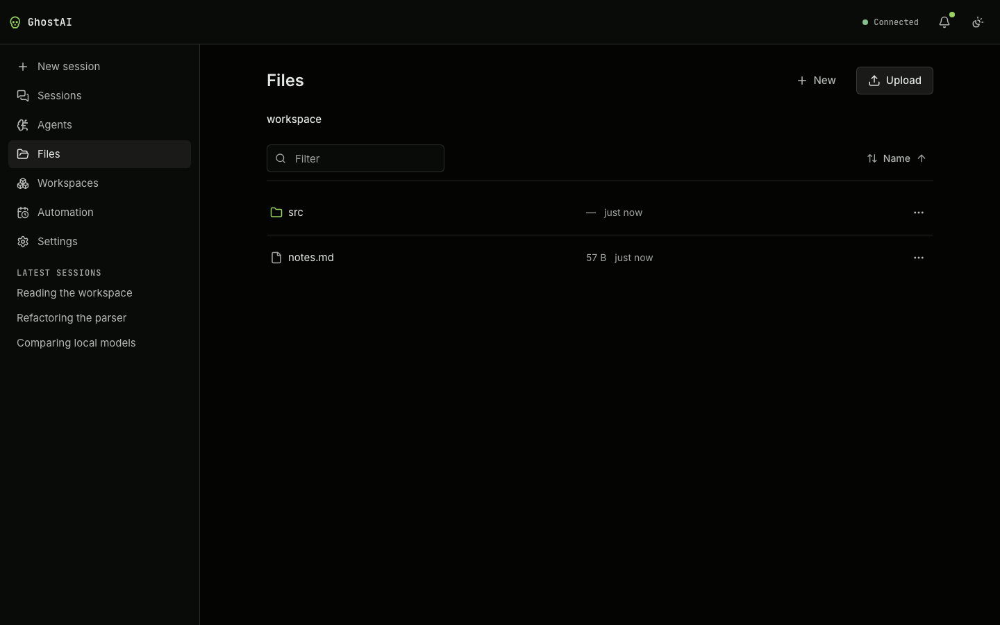

# Web UI

React 19 and Vite, served by the same process as the agent. TanStack Router and Query,
Zustand for chat state, Radix for the headless primitives, Shiki for highlighting loaded
on demand.

<picture>
  <source media="(prefers-color-scheme: light)" srcset="screenshots/chat.light.png">
  
</picture>

Every picture on this page and in the README is generated, not taken by hand:
`pnpm screenshots` boots the same harness the browser suite runs against and drives each
screen to the state worth showing. Two runs on one machine produce byte-identical files,
so a changed image in a diff means the UI changed. See
[Development](development.md#screenshots).

**No CSS framework.** Hand-written CSS in five cascade layers — `reset`, `base`,
`layout`, `components`, `screens` — declared in that order. A component names what it _is_
(`.tool-card`, `.sidebar__link`) and the stylesheet says what that looks like.

**No external asset, ever.** Fonts come from npm, icons are inline, and two tests enforce
it — one scanning the source, one running the whole app in a browser with every foreign
origin blocked. See [Security](security.md#privacy).

## Screens

| Route                             | What it is                                                    |
| --------------------------------- | ------------------------------------------------------------- |
| `/`                               | Chat. `?session=` picks the session.                          |
| `/agents`, `/agents/:id`          | Agent list and editor.                                        |
| `/workspaces`, `/workspaces/:id`  | Workspace list and editor.                                    |
| `/files`                          | File browser. `?path=` and `?workspace=` are in the URL.      |
| `/notifications`                  | The archive.                                                  |
| `/settings`                       | `?panel=` picks the tab.                                      |
| `/settings/providers/:instanceId` | One endpoint's editor.                                        |
| `/tokens`                         | Every design token and primitive on one page. Not in the nav. |

The shell is two columns; below `md` the sidebar becomes a drawer rather than a narrowed
rail. The header carries the wordmark, a connection badge with a Reload action, the
notification bell and the theme switcher.

The sidebar's session list is a **shortlist of the thirty most recent conversations**, and
a delegated run is not one of them — a subagent gets a session of its own, but it is a
step inside a conversation rather than a conversation someone had. Those rows are excluded
from this column only: `/sessions` lists every origin and badges the machine-started ones,
and a run is also reachable from the subagent card in the transcript that started it.

**The WebSocket hangs off the root route**, so moving between screens never redials it and
never drops a running turn.

## Chat

- Answers stream in; reasoning arrives in a separate collapsible block.
- **Tool cards** — one per call, with the risk badge, running/succeeded/failed status,
  progress ticks for slow calls, and a flag when output was truncated.
- **Approval prompts** show the arguments before the call runs, and take Approve once /
  this session / always, or Deny. See [Tools & permissions](tools.md#answering).
- **Subagent cards** nest inside the call that started them, and survive a reload
  _during_ the delegation with everything the subagent had already written. The replay
  ring cannot do that on its own — it holds 512 frames and a subagent emits one per token
  — so the server keeps the running turn whole beside it and replays that instead,
  including every nested step; see [API](api.md#sequencing-and-replay). The bound is
  `server.turnLogMaxBytes`, and a turn that outgrows it falls back to picking the run up
  from the moment the tab reattaches. A second tab, which has no cursor and so asks for no
  replay at all, does that too, and fills in the rest when the turn ends.
- **Notices** badge prompt injection, degraded requests, provider fallback, truncated
  history, a denied approval, a fallback to another agent, and a turn that ran with tools
  switched off.
- **Turn info** — tokens in and out, cached tokens, elapsed, time to first token,
  tokens per second, model, provider, step count, stop reason. Elapsed covers the
  whole turn; first token is what a cold model load looks like; the rate divides by
  generation time alone, so it stays steady across a cold and a warm run.
- Markdown with highlighted code blocks.

A tool card, expanded to show what the call returned:

<picture>
  <source media="(prefers-color-scheme: light)" srcset="screenshots/chat-tool-call.light.png">
  
</picture>

An approval prompt. The turn is parked here — the arguments are on screen and nothing has
run yet:

<picture>
  <source media="(prefers-color-scheme: light)" srcset="screenshots/chat-approval.light.png">
  
</picture>

### Composer

- Auto-growing textarea measured with a mirror element, so it holds up under browser zoom.
- **Send ⇄ Stop follows the session status.** Enter still queues while a turn is running,
  and the composer says the message is queued rather than going grey.
- **Steering** — what you type mid-turn reaches the running turn, not the next one.
- **Attachments upload when you pick them**, not on send, so a large file is already there
  when you hit Enter.
- An agent picker, and a context budget strip.

### Slash commands

Type `/` in the composer and the completion list opens: arrow keys move, Enter or Tab
accepts, Escape closes. Focus never leaves the box, so the sentence you are part-way
through is never interrupted.

| Command              | What it does                                         |
| -------------------- | ---------------------------------------------------- |
| `/new`               | Starts a fresh session and goes to it                |
| `/clear`             | Drops this session's transcript, keeping the session |
| `/rename <title>`    | Retitles this session                                |
| `/stop`              | Aborts the turn that is running                      |
| `/branch`            | Forks at your last message and continues in the fork |
| `/agent <id>`        | Which agent this session runs on                     |
| `/model <id>`        | Which model this session's agent runs on             |
| `/effort <level>`    | How hard that agent is asked to think                |
| `/temperature <0-2>` | The sampling temperature that agent sends            |

`/agent`, `/model` and `/effort` complete their argument as you type it, which is the
browser's answer to the terminal's arrow-key menu and Telegram's picker keyboard.
`/temperature` does not: its argument is a number in a range, which a list cannot
enumerate. A command that needs nothing further closes the list as soon as it is spelled
out, so `/stop` and Enter is one keypress.

The last three **edit the agent this session runs on, and save** — the same write the
Agents panel makes, against the same fields. There is no settings layer above an agent,
so the agent is the only place these live: the change follows it everywhere it runs, and
it survives a restart.

`/effort` lists its levels as you type, marks the one in force, and opens on it — so the
question "what is it now" is answered by the list rather than by going to the Agents
panel. `/temperature` does not list: its argument is a number in a range.

Both take `default`, which is not the same as a low setting. `/effort off` sends a
parameter asking the model not to think; `/effort default` sends no reasoning parameter
at all, which is the only thing that works against an endpoint that rejects the field.
`/temperature 0` is a value in the same way: it is not an absence.

Two read differently from the terminal, on purpose. `/new` takes no title — nothing is
stored until the first message, so there is nothing to title yet; use `/rename`.
`/branch` takes no ref — every message on screen carries its own Branch action, so the
only point a typed command usefully names is the last thing you said.

A message is only a command when it opens with a slash followed by nothing but lowercase
letters, so `/usr/bin/env is on the path` reaches the model as the sentence it is. A
message carrying an attachment is never a command either.

### Message actions

**Edit** a user message and re-run from the new wording. **Regenerate** an answer.
**Branch** either into a new session, leaving the original intact. **Info** for the
turn's cost. **Copy**.

Destructive actions are disabled mid-turn, and anything needing a sequence number stays
disabled until the message has landed.

### Context inspector

A bar showing the whole context window and where it went — system prompt, tool
definitions, session — with overflow stated in words rather than a clipped bar. It is
the same measurement the CLI's `/context` prints and `GET /api/sessions/:key/context`
returns, so all three agree.

**It moves while a turn runs.** The loop reports the figure at the end of every tool
iteration on a `context.usage` frame, and the strip takes the numbers straight off it
rather than refetching — the response carries the whole system prompt, every tool
definition and every windowed message, and pulling that back forty times in one turn to
move four integers is not a trade worth making. Opening the panel re-measures, because
that is the moment anyone reads the lists rather than the total.

This is the screen that answers "why did it forget what I said", and it used to answer it
one turn late: a twenty-step turn appends most of a window before it ends, which is
exactly when the question gets asked.

**It shows what is sent, and counts what is sent.** The panel prices every section as
the request body carries it — through the same encoder the provider is spoken to with —
so what a model never receives is neither listed nor billed. That is why an assistant's
reasoning is absent here while the transcript still shows it in the collapsible block
beside the answer: the wire has never carried it, and a dimmed copy of it on this screen
read as "this is in your window". A tool's risk band is the same rule seen from the
other side — badged in the list, because it decides whether a call needs approving, and
not in the figure, because no model has seen one.

One divergence is left, and it goes the other way: a file attachment is counted as the
reference the window holds, while the request carries the file's contents. A session
with large attachments therefore reads low. Expanding them to measure would mean reading
every attached file again at the end of every tool iteration, which is a real cost on a
long turn to move a bar.

<picture>
  <source media="(prefers-color-scheme: light)" srcset="screenshots/context.light.png">
  
</picture>

## Files

Browse the workspace tree with filter and sort. Upload by button or drop. Create folders
and files, rename, move, delete with a confirm. Text editing with syntax highlighting, and
**save-conflict detection** — if the agent changed the file underneath you, the save is
refused rather than silently winning. Media previews go through short-lived signed URLs.

<picture>
  <source media="(prefers-color-scheme: light)" srcset="screenshots/files.light.png">
  
</picture>

## Workspaces

Create one with a folder of its own choosing. Rename the label without moving the folder,
or move the folder on disk — which renames the directory and repoints the sessions.
Move sessions between workspaces. A workspace with sessions cannot be deleted
until they move.

A workspace is where a conversation's **files** live, not a drawer conversations are
filed under — so there is exactly one control for it, and the session list is never
scoped by it. The workspace picker sits beside the agent picker under the message box:
it names which workspace the open conversation's tools use, and moving it writes the
binding on the session. The move takes effect from the next turn — a turn already
running finishes in the workspace it started in.

The Files page opens at the default workspace, which is the parent of every named one,
so they appear there as ordinary folders and are opened by clicking into them. Named
workspaces cannot see each other.

Which workspace a given turn actually ran in is recorded per turn and shown in the turn
details popover, because a conversation that has been moved spans more than one.

## Agents

Create, rename, enable, delete. Per agent: the model, provider, reasoning effort and
temperature; limits (output tokens, context window, tool iterations, tool timeout, turn
timeout); the **system prompt** on the screen and the other seven templates behind an
**Advanced prompt settings** disclosure, each with a warning for stray placeholders; the
**per-tool permission map**; the **container** selection, which decides where `exec` runs
and nothing about what the agent may call; the **network** block, which appears once a
container is chosen and shows its allow-lists only under `allowlist`; and the **subagent
list**, each with its own description and permission.

Model and budget live on the agent, not in Settings — they are properties of an agent, and
an install with several agents has several answers.

## Automation

A page rather than a settings panel, in the nav above Settings, built out of the same CRUD
chrome as Agents and Workspaces: filter, sort, `DataList` rows, a kebab, a create dialog
and a confirm on delete. Per job: the schedule (once at a time, on an interval, or on a
cron expression, read in `ui.timezone`), what it does (a fixed message, or a heartbeat that
reads a task file and decides), the agent it runs on, an optional pinned session key, and
delivery. Below it, the **run history** — each run's outcome, output, skip reason, error
and any warnings.

The scheduler's own switches are **not** here — enabled, catch-up on boot, concurrency and
how much history to keep per job are install-wide, and live in Settings → Automation. The
split is the one Agents already makes: the agents are a page, and only install-wide tool
settings sit in Settings.

A row reports where the last run **landed** and when the next one is due, never whether one
is in flight. Keeping that honest would mean polling, and it is exactly the transient state
the e2e rule says not to build a UI around.

## Creating things

Every CRUD screen follows one rule: **`New X` is a link to `/x/new`, not a dialog.** That
route renders the same component the editor renders, seeded from defaults instead of from
a stored row, plus whatever fields only exist at creation. Save writes and navigates to
the row it made; the editor's Save patches.

The rule exists because a dialog that creates on submit has to invent the settings to
create _with_ — a job got a message made from its name, an agent a copy of the default
one, a workspace a `mkdir`. Abandoning the editor you landed on left that invented row
behind. Nothing is written before Save now, so an abandoned create leaves nothing.

| Screen     | Route                     | Asked only at creation                                    |
| ---------- | ------------------------- | --------------------------------------------------------- |
| Automation | `/automation/new`         | —                                                         |
| Agents     | `/agents/new`             | The identifier, which follows the name until you type one |
| Workspaces | `/workspaces/new`         | The folder — a `mkdir` now, a `rename(2)` later           |
| Providers  | `/settings/providers/new` | The type, fixed for the life of an instance               |

Duplicating an agent stays a direct create: it has a source to copy, so there is nothing
to fill in first.

## Settings

| Panel        | State                                                                                                                                                                  |
| ------------ | ---------------------------------------------------------------------------------------------------------------------------------------------------------------------- |
| Providers    | Built. Add by type, save endpoint and key in one press, test the connection before saving, per-endpoint model catalogue, enable/disable, delete takes the key with it. |
| Tools        | Built. Approval timeout, `exec` settings and output caps. **No permission matrix here** — permission is per tool per agent.                                            |
| Environments | Built. A list and an editor for the definitions on disk, plus the containers held open for them.                                                                       |
| Account      | Built. Username and password together, requires the current password, revokes every other session.                                                                     |
| Appearance   | Built. Language and timezone (install-wide) and theme (this browser only).                                                                                             |
| Automation   | Built. The scheduler engine only: enabled, concurrency, catch-up on boot, run retention. **The jobs are a page.**                                                      |
| MCP servers  | Built. A list and an editor, each row joining what an operator configured to what came of it.                                                                          |
| Channels     | Built. Reach the same agent from a messaging app. The bot token goes to the vault, never to `config.yaml`.                                                             |
| Extensions   | Built. Approve, withdraw and disable. **No editor** — an extension is a directory an operator put on the box, and a form would imply this screen could change it.      |

Every panel on that list is built, and a panel arrives on it once it has something to
configure. There are deliberately no placeholders naming a future phase: a settings
screen advertising a form an operator cannot open is one they check twice.

Approving is the only reversible action in Settings that asks first. It grants the code
the server's own access, so it goes through the confirm dialog with the sentence that
says so; a one-click toggle would make the digest gate decorative. Withdrawing does not
ask, because it takes access away and leaves the files where they are.

**Environments is the one panel that writes outside `config.yaml`.** A definition is a
file in the policy directory, which sits beside the workspace rather than inside it, so
nothing a tool can write reaches one. The editor covers the whole definition, hardening
included: a form that edited the memory limit and left the capability set to a text
editor would be two doors into one room, and the one people found would be the one that
could not express what they needed. It cannot widen what the file already refuses, since
a save clears exactly the checks a hand-written file clears.

The warnings on a row — what hardening a definition weakens, whether a restricted
allow-list could be enforced in it — are resolved on the server, so the terminal and the
browser cannot describe one definition differently. They are the last saved state and
refresh on save. A file that did not parse still gets a row, named rather than opened:
deleting it is the way out, and there is nothing to load into a form.

Below it, the containers currently running. Stopping one is safe and is never gated: the
next command starts a fresh one from the same definition.

Each MCP row joins two requests — `GET /api/settings` for what was
configured, `GET /api/mcp` for what came of it — and settles on its own, because the
`tools.changed` frame a server connecting or dropping already produces is what
invalidates the status query. The reason a server is unreachable is on the row; the
warnings it raised about itself are in the editor, beside the fields that fix them.

## First run

Five steps: language → code → password → provider → model. Language first, because
everything after it is prose. The code and password are mandatory; the provider and model
are skippable, and skipping lands you in a working app — files, workspaces, settings and
notifications all work, and only the composer is disabled, with a link to the panel that
fixes it.

<picture>
  <source media="(prefers-color-scheme: light)" srcset="screenshots/setup.light.png">
  
</picture>

## Theme

Three states, not two: `dark`, `light` and `system` — following the OS is a real choice,
not the absence of one. The stored value is the _preference_; the resolution is stamped
onto the document by a blocking inline script before first paint, so there is no flash.

Dark-first, but **every end-to-end assertion runs twice**, once per scheme, because
reviewing only in dark is how a light theme ships broken.

## Design tokens

`styles/tokens.css` is the **only** file allowed to contain a raw colour or a `px`
literal. Every colour derives from a per-theme seed block in OKLCH — about two dozen
numbers — and the tokens are formulas over them. Every length is a `rem`, so browser zoom
works. Elevation is a surface plus a stroke; there is no shadow scale.

Three gates enforce it, run in CI as their own step because no single linter reads all
three, and they hold across CSS, TSX class strings and `index.html`:

1. **`no-px`** outside `tokens.css`
2. **`no-raw-color`** outside `tokens.css`
3. **`accent-position`** — `--accent` fills; `--accent-fg` is text, icons and strokes

Plus a contrast test that parses the real stylesheet in both themes and holds every
text-on-surface pairing to WCAG AA. A seed edit that darkens text past the line fails the
suite rather than shipping.

`/tokens` in the running app renders every token and primitive on one page, which is the
fastest way to see what a change did.

## Accessibility

Held by tests rather than by intent: at 200% font size every screen reflows without a
horizontal scrollbar and the composer stays usable; every screen fits a phone; every
keyboard stop takes a visible focus ring; dialogs trap focus, close on Escape and return
focus; every message action is reachable and named; and no theme is second-class — there
is no invisible text on any screen in either.

## Languages

The translation layer is complete and **English is the only shipped locale**. The JSON
bundle _is_ the type, so a misspelled key is a compile error, and errors carry a
translatable key across package boundaries.

Adding a language is a `locales/<tag>/` directory plus one entry in the supported list —
negotiation, plural handling and right-to-left detection already work.

## Working on it

Run `pnpm --filter @ghostwire/web dev` for an edit-reload loop; Vite proxies `/api` and
`/ws` to a running `ghostai serve`.

**There is nothing to restart after a production UI build.** The bundle is compiled into
the binary, so a rebuild produces a new `ghostai` rather than moving files underneath a
running one — which removes the gotcha this paragraph used to warn about, where a fresh
`index.html` was served beside 404ing hashed assets and the result was a blank page that
looked like a crash and was not one. `--ui <dir>` serves a directory instead, and is the
escape hatch for working on the UI itself.
